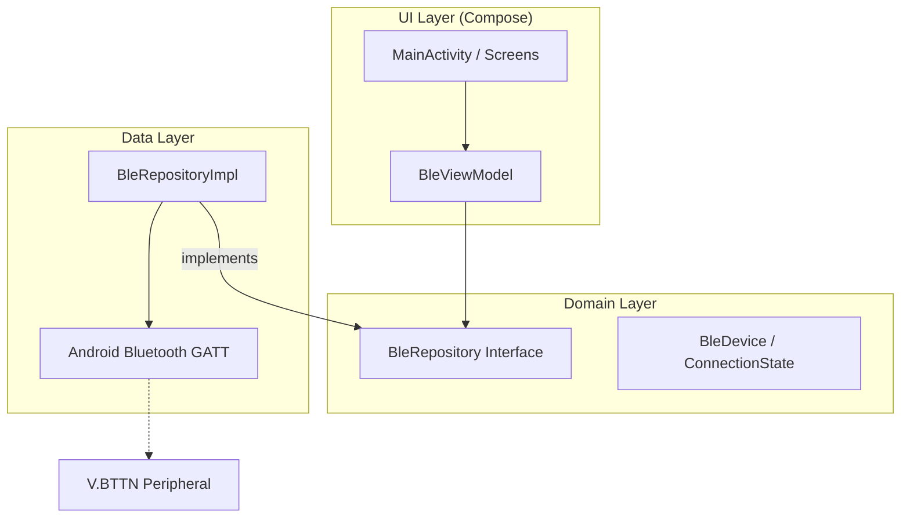

# GattConnect-BLE

BleVButton is a production-ready Android application designed to scan for, connect to, and interact with **V.BTTN** Bluetooth Low Energy (BLE) peripherals. It features a modern, energetic Material 3 interface and implements the custom V.BTTN hardware protocol for event detection and acknowledgment.

## 🚀 Features

- **Real-time BLE Scanning**: Discovery of nearby BLE devices with live RSSI (signal strength) updates.
- **V.BTTN Protocol Support**: Automatic verification, configuration, and event parsing for V.BTTN hardware.
- **Event Monitoring**: Terminal-style log for tracking button presses, releases, long presses, and fall detections.
- **Manual Controls**: Ability to acknowledge events and stop device blinking alerts remotely.
- **Adaptive UI**: Responsive design for phones and tablets with Material 3 styling and dynamic color support.

## 🛠 Technology Stack

- **Language**: Kotlin
- **UI Framework**: Jetpack Compose (Material 3)
- **Dependency Injection**: Hilt
- **Architecture**: MVVM + Clean Architecture
- **Concurrency**: Kotlin Coroutines & Flows
- **SDK**: targetSdk 37, minSdk 24

## 📐 Architecture

The project follows Clean Architecture principles, ensuring a clear separation of concerns between the UI, business logic, and data layers.

## 🔄 Workflow & Protocol

### 1. Discovery
The app uses `BluetoothLeScanner` to find devices. RSSI values are updated in real-time within the `scannedDevices` Flow.

### 2. V.BTTN Connection & Verification
Upon connection, the app performs the following critical steps within the `setupVBttn` sequence:
1. **Verification**: Writes the proprietary key `80:BE:F5:AC:FF` to the Verification characteristic (`FFFFFFF5...`) within 30 seconds.
2. **Configuration**: Writes `0x07` to the Detection Config characteristic (`FFFFFFF2...`) to enable Short/Long press and Fall detection.
3. **Subscription**: Enables notifications on the Notification characteristic (`FFFFFFF4...`).

### 3. Event Handling
When a notification is received, it is parsed based on the following codes:
- `0x01`: Button Pressed
- `0x00`: Button Released
- `0x03`: Long Button Press (Triggers an automatic ACK `0x01`)
- `0x04`: Fall Event Detected
- `0x05`: High-G Event Detected

### 4. Acknowledgment & Clearing
Users can manually interact with the `LONG_PRESS_ACK_UUID` (`FFFFFFF3...`):
- **Acknowledge (`0x01`)**: Confirms receipt of the event.
- **Clear Blinking (`0x00`)**: Stops the device's red-green LED visual alert.

## 📦 Installation

1. Clone the repository.
2. Open in Android Studio (Ladybug or newer recommended).
3. Ensure Bluetooth and Location permissions are granted on the test device.
4. Build and run on an Android 8.0 (API 26) or higher device.

## 📄 License
Internal Development - Google Jetpack Training.
